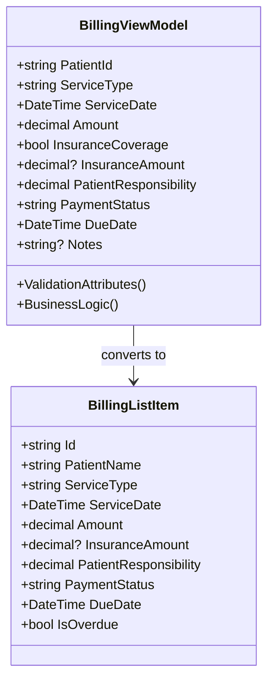
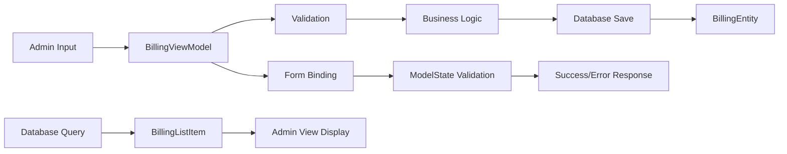
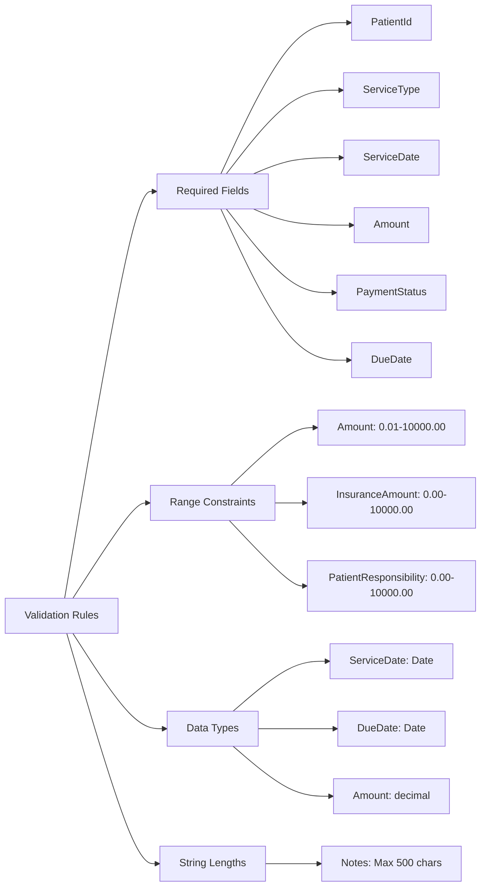
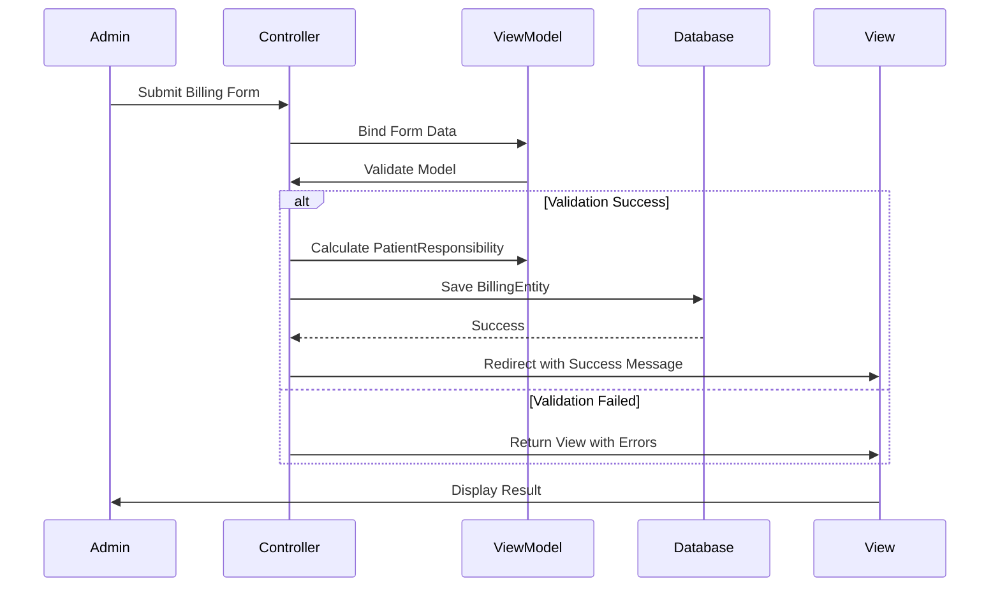

# BillingViewModel Class Structure

## Class Diagram



## Property Details

```mermaid
graph TD
    A[BillingViewModel] --> B[PatientId]
    A --> C[ServiceType]
    A --> D[ServiceDate]
    A --> E[Amount]
    A --> F[InsuranceCoverage]
    A --> G[InsuranceAmount]
    A --> H[PatientResponsibility]
    A --> I[PaymentStatus]
    A --> J[DueDate]
    A --> K[Notes]
    
    B --> B1[Required]
    B --> B2[string]
    
    C --> C1[Required]
    C --> C2[string]
    
    D --> D1[Required]
    D --> D2[DataType: Date]
    D --> D3[Default: Today]
    
    E --> E1[Required]
    E --> E2[Range: 0.01-10000.00]
    E --> E3[decimal]
    
    F --> F1[bool]
    F --> F2[Default: false]
    
    G --> G1[Range: 0.00-10000.00]
    G --> G2[decimal?]
    G --> G3[Nullable]
    
    H --> H1[Range: 0.00-10000.00]
    H --> H2[decimal]
    
    I --> I1[string]
    I --> I2[Default: "Pending"]
    
    J --> J1[DataType: Date]
    J --> J2[Default: Today + 30 days]
    
    K --> K1[StringLength: 500]
    K --> K2[string?]
    K --> K3[Nullable]
```

## Data Flow



## Validation Rules



## Business Logic Flow



## Entity Relationships

```mermaid
erDiagram
    BillingViewModel {
        string PatientId FK
        string ServiceType
        date ServiceDate
        decimal Amount
        bool InsuranceCoverage
        decimal InsuranceAmount
        decimal PatientResponsibility
        string PaymentStatus
        date DueDate
        string Notes
    }
    
    BillingEntity {
        string Id PK
        string PatientId FK
        string ServiceType
        date ServiceDate
        decimal Amount
        decimal InsuranceAmount
        decimal PatientResponsibility
        string PaymentStatus
        date DueDate
        string Notes
        date CreatedAt
        date UpdatedAt
    }
    
    IdentityUser {
        string Id PK
        string UserName
        string Email
    }
    
    BillingViewModel ||--|| BillingEntity : converts to
    BillingEntity ||--|| IdentityUser : belongs to
    BillingViewModel ||--|| IdentityUser : references
``` 